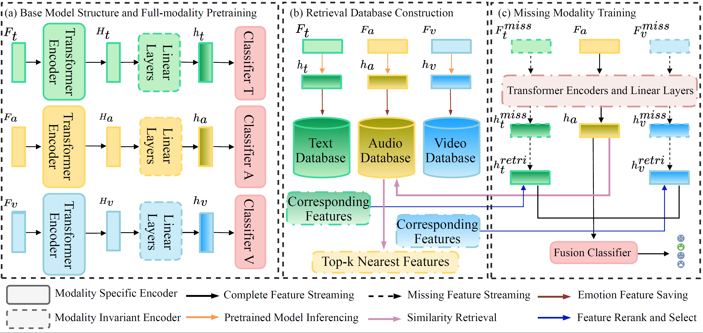

# Leveraging Retrieval Augment Approach for Multimodal Emotion Recognition Under Missing Modalities
</h2>

<p align="center">
  
  
</p>

### STATUS: Under review


### Overview
<div style="text-align: center">

</div>


### Key Implementations

- Don't add Multimodal interaction in the Pretrain Model ;
- First pretrain the Unimodal Basemodel in `models/pretrain_model.py`.
- Inferencing the whole dataset and saving the hidden state in `models/pretrain_model.py line 86/99/111  cls_output_A/V/L`.
- FAISS index creating `models/retrieval_augmentor.py line 192`;
- Retrieval approach `models/retrieval_augmentor.py line 141 get_most_similar_vectors`;
- Utilizing retrieval approach `models/retrieval_model.py line 105, 215`.


### Installations and Usage

Create a conda environment with PyTorch

```
conda create --name RAMER python=3.9
conda activate RAMER

pip install torch torchvision torchaudio numpy pandas sklearn scipy tqdm pickle omegaconf
conda install pytorch::faiss-gpu
```

We follow Zhao et al. [MMIN](https://github.com/AIM3-RUC/MMIN/tree/master) and Zuo et al. [IF-MMIN](https://github.com/ZhuoYulang/IF-MMIN) to construct the missing modality conditions. 


### Dataset Preparation
#### MER2024 Dataset

Please download and fill out the End User License Agreement, then send it to merchallenge.contact@gmail.com to access the data. The EULA file and the contact information can be found at [MER2024](https://github.com/zeroQiaoba/MERTools/tree/master/MER2024). 

Then you need to 
```
git clone https://github.com/zeroQiaoba/MERTools.git
```
to process the dataset and extract the multimodal features.

The specific utilization can be found at the address above.

Other requirements can also refer to the [MER2024](https://github.com/zeroQiaoba/MERTools/tree/master/MER2024) GitHub repository.


### Acknowledgment
Thanks to the MER Challenge 2024 Committee for their support and resources.

